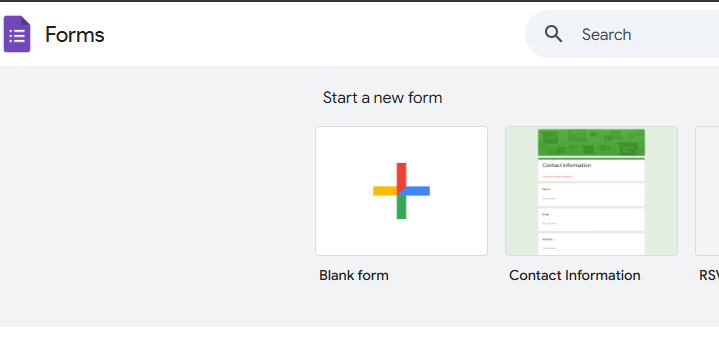
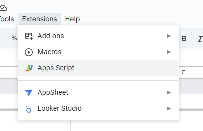
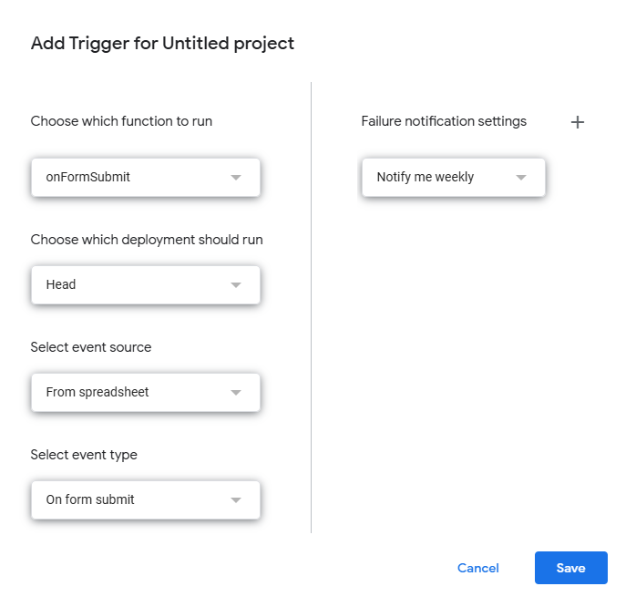
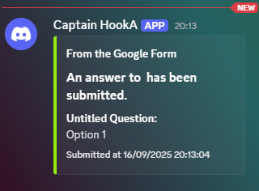

<h1 align="center">Form2Cord</h1>

Below are some stuff you will need :)

---

  
<strong>how</strong>

  <ul>
    <li>You have to edit the Webhook URL in <a href="https://github.com/Epicinver/Form2Cord/blob/main/source/Form2Cord.appscript.js"><code>Form2Cord.appscript.js</code></a></li>
    <li>Then, you make a new form.</li>
    

      
    

    <li>Go to the "Responses" tab.</li>
    

      
    

    <li>Link to a Google Sheet</li>
    

      
    

    <li>Go to Extensions > Apps Script</li>
    

      
    

    <li>Paste in the script you edited earlier (with your webhook)</li>
    <li>Go to "triggers"</li>
    

      
    

    <li>Add a trigger with these settings: </li>
    

      
      
    

    <li>Then publish your form and test!</li>
    <li>If setup correctly, you will see something like this:</li>
    
  </ul>

---

<em>thanks for using this :)</em>

                                           👆 is some info

